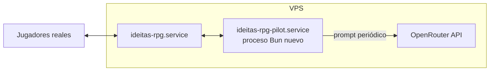

# Aquiles companion — estado

**Implementado (2026-07-18):** bot simple siempre online, **sin LLM**.

- Código: `/opt/ideitas/rpg/bot.ts`
- Unit: `ideitas-rpg-bot.service` (arranca junto a `ideitas-rpg.service`)
- Credenciales: `/etc/ideitas/rpg-bot.env` (`BOT_NAME` / `BOT_PASS`)
- Comportamiento: sin grupo caza el enemigo más cercano (Los Olivares); en grupo acepta invitaciones
  de grupo, sigue al compañero humano (`party_follow`), ayuda a golpear mobs
  cercanos al líder, respawnea solo, saluda a jugadores cercanos / si le
  mencionan en el chat.

La propuesta LLM de abajo queda como idea futura opcional.

---

# Propuesta: Aquiles como compañero IA

Idea: que el héroe de pruebas **Achilles** (guerrero nivel 2, ya existe en la base de
datos) pueda estar en línea de forma permanente/programada, controlado por un modelo
de lenguaje barato vía OpenRouter, para acompañar a los jugadores reales — no un bot
de farmeo, sino un "compañero" con algo de personalidad.

Esto es un **documento de diseño para discutir, todavía no implementado**. Requiere
una decisión del dueño del sitio antes de construirlo: presupuesto de API, con qué
frecuencia corre, y qué tan "vivo" debe sentirse.

## Por qué es viable sin tocar el protocolo

Aquiles ya es un jugador normal en la base de datos (`players` table, fila `Achilles`).
El servidor no distingue entre un cliente humano y cualquier otro socket que hable el
protocolo WebSocket de `PROTOCOL.md`. Un "piloto" de Aquiles es sencillamente **otro
proceso Bun** que:

1. Abre un WebSocket a `wss://ideitas.online/rpg/ws` (igual que el navegador).
2. Envía `{t:"login", name:"Achilles", pass:"…"}`.
3. Recibe `welcome` / `map` / `you` / `st` como cualquier cliente.
4. En vez de dibujar un canvas, alimenta el estado a un modelo vía OpenRouter cada
   pocos segundos y traduce la respuesta a mensajes de protocolo (`dir`, `attack`,
   `skill`, `chat`, `talk`, `party_*`…).

No hace falta ningún cambio en `server.ts` — el piloto es un cliente más.

## Arquitectura propuesta



- **`/opt/ideitas/rpg/pilot.ts`** (nuevo): cliente WS + bucle de decisión.
- Systemd unit propia (`ideitas-rpg-pilot.service`), hardened igual que las demás,
  con `EnvironmentFile=/etc/ideitas/roast.env` para reusar la key de OpenRouter que
  ya está configurada para el resto del sitio (ver `/mercadillo` en el Caddyfile).
- El piloto corre en el mismo host, así que habla con el server por `127.0.0.1:8792`
  directo (sin pasar por Caddy/TLS) — más simple y sin costo de red.

## Bucle de decisión (propuesto)

Cada ~4–8 s (no cada tick — un LLM no necesita reaccionar a 15 Hz):

1. Junta un resumen compacto del estado: posición, HP/MP, entidades cercanas
   (nombre, tipo, distancia, si son jugadores reales o monstruos), misión activa,
   mensajes de chat recientes dirigidos a él.
2. Manda ese resumen a un modelo **barato y rápido** de OpenRouter (candidatos:
   `google/gemini-flash-1.5`, `meta-llama/llama-3.1-8b-instruct`, o similar — el
   costo por decisión es mínimo porque el prompt es corto y la salida es un objeto
   JSON pequeño).
3. Pide una salida **estructurada** (JSON schema), p. ej.:
   ```json
   { "action": "attack" | "move_to" | "follow" | "say" | "idle",
     "targetId": 123,
     "text": "¡a por él!" }
   ```
4. Traduce esa acción a 1–2 mensajes de protocolo reales (`attack`, `dir` calculado
   hacia un punto, `chat`).
5. Entre decisiones, el piloto puede seguir enviando `dir` en un bucle más rápido
   localmente (p. ej. perseguir al objetivo elegido) sin volver a llamar al modelo —
   el LLM decide la *intención*, un poco de código normal ejecuta el *cómo*.

Esto evita el error común de "un LLM jugando en tiempo real": no se le pide que
calcule física de combate ni pathing, solo que elija una intención de alto nivel con
baja frecuencia; el código determinista hace el resto (igual que ya hace la IA de
los monstruos en `server.ts`).

## Personalidad

- System prompt corto fijando el tono: guerrero griego, unas pocas frases de sabor
  (referencias a la Ilíada, bravuconería moderada), responde en español, evita spam
  de chat (cooldown propio de varios segundos entre líneas, además del rate-limit
  del servidor).
- Reacciona a que le hablen por chat (si un jugador menciona "Achilles" o le habla
  cerca, prioriza responder en la próxima decisión).
- Puede aceptar invitaciones de grupo (`party_accept`) si alguien lo invita — encaja
  con el modo "seguir" descrito en `PARTY_FOLLOW.md`.

## Costo y límites (a decidir)

- Con un modelo barato y decisiones cada ~5 s, el costo es del orden de centavos por
  hora de actividad — pero **debe correr con un horario**, no 24/7 sin límite, salvo
  que se decida lo contrario.
- Propuesta conservadora: un `systemd` timer que lo enciende en ventanas conocidas
  (p. ej. cuando el dueño avisa que va a jugar), o un comando manual
  (`systemctl start ideitas-rpg-pilot`) en vez de `enable` automático.
- Guardarraíles: límite duro de mensajes de chat por minuto, tope de gasto diario en
  OpenRouter vía el proxy ya existente (`/openrouter/api/v1/chat/completions`, que ya
  aplica *allowlist* de modelos y rate limits — el piloto debería pasar por ese mismo
  proxy en vez de hablarle a OpenRouter directo, para heredar esos controles).

## Qué falta antes de construirlo

1. **Decisión del dueño**: ¿qué modelo, qué presupuesto, corre siempre o por
   ventanas, se anuncia a los jugadores que Achilles es IA?
2. Confirmar que el proxy interno de OpenRouter (puerto 8791) acepta llamadas desde
   otro proceso local del mismo servidor (debería, es solo HTTP interno).
3. Diseñar el JSON schema exacto de la decisión y probar 15–20 min en un entorno de
   prueba (DB separada) antes de soltarlo con jugadores reales.

Cuando haya luz verde en estos puntos, implemento `pilot.ts` + la unit de systemd.
